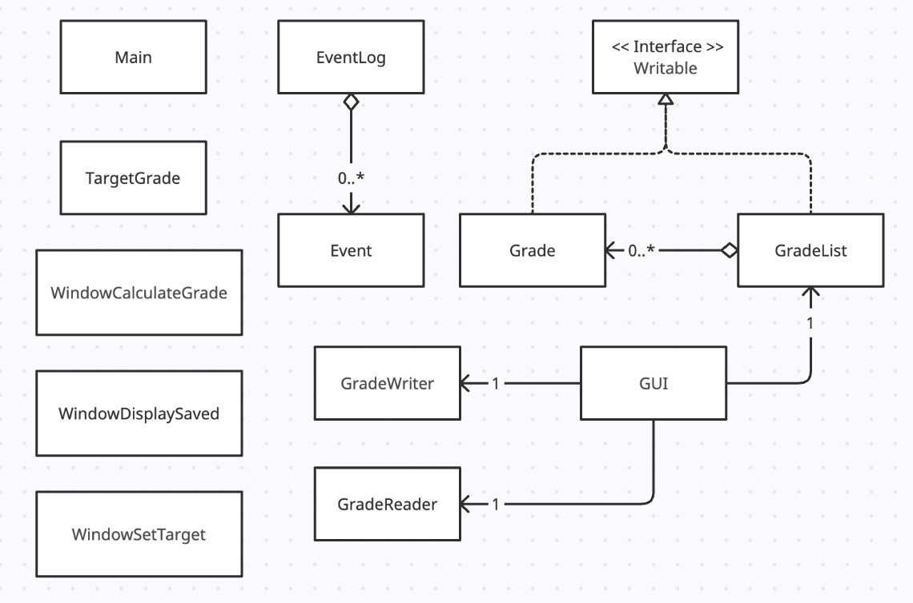

# UBC Grade Calculator


## About the Project 
Have you ever been worried about whether you'll actually pass a specific course toward the end of the semester? 
If this sounds like you, then you've come to the right place. This application is specially designed to help you and 
all other students at UBC who want to have an easier time calculating their final grade for each of their class and 
predict what percentage they must score on the final exam to pass. Furthermore, it provides you with an opportunity 
to set a realistic target and this application will help you determine what you need to get on your final exam to 
obtain that awesome grade that you desire.

The reason I chose to make this project is because I am the type of person who always wants to know and set goals 
for myself about what I need to score on that final exam in order to receive a good grade. I am also very passionate 
about creating something that everyone can use and benefit from. 
Thus, I hope that the visual illustration of this project will motivate you to study harder so that you will also 
receive the grade that you desire.

## User Stories 
- As a user, I want to be able to add a grade on my Grade Calculator. 
- As a user, I want to be able to display the grade calculated on my Grade Calculator.
- As a user, I want to be able to convert the grade calculated into a letter grade on my Grade Calculator.
- As a user, I want to be able to set a realistic target on my Grade Calculator.
- As a user, I want to be able to save the previous grade calculated (if I choose) on my Grade Calculator.
- As a user, I want to be able to load the previous grade calculated from file (if I choose) on my Grade Calculator.

## Instructions for Grader
- You can add a grade from your desired course by clicking the "Calculate Grade" button.  
- You can see the calculated grade as a percentage from the input of your grade components. 
- You can see the calculated grade as a letter grade from the input of your grade components. 
- You can set a realistic target from your desired course by clicking the "Setting Target" button. 
- You can locate my visual component on the main menu or on each of the popup screens.
- You can reload the state of my application by clicking on the "Load Previously Saved Calculation" button. 
- You can save the state of my application by clicking on the "Save Current Calculation" button after the process of
calculating your grade.

## Phase 4: Task 2 (Event Log Sample)
```
--- My Event Logs---
Wed Apr 05 18:39:29 PDT 2023
Added CPSC210 with a Lab grade of 80.0% that weights 25.0%

Wed Apr 05 18:39:39 PDT 2023
Added CPSC210 with a Exam grade of 100.0% that weights 75.0%

Wed Apr 05 18:39:39 PDT 2023
Grade Average Calculated!

Wed Apr 05 18:39:41 PDT 2023
Grade Calculation Saved!
```
## Phase 4: Task 3 (Design Reflection)

#### UML Diagram


#### Refactoring Possibilities

The diagram generally follows a tree-like structure with association arrows only pointing in one direction. 
This is because I have incorporated a few design principle like the Singleton Design Pattern (i.e., 
the EventLog class with its private constructor) as well as making each method reusable to avoid duplication
(i.e., the initializeButton method in the GUI class where it takes in a JButton as an argument and set the 
properties of that button).

However, I believe there are still many possible refactoring ideas available to improve my design. One idea 
is to refactor each component of the GUI class into its own little class, which would improve cohesion 
of the program without introducing too much coupling. Another idea is to reduce the dependencies of the GUI 
class (i.e., WindowCalculateGrade or WindowDisplaySaved or WindowSetTarget) by refactoring them and making 
all the features self-contained. Therefore, by implementing these in the future, I will be able to achieve 
high-cohesion and low-coupling in my program.

## Credits
- The basic structure of data persistence is influenced by 
[JsonSerializationDemo](https://github.students.cs.ubc.ca/CPSC210/JsonSerializationDemo).
- The basic structure of event log is influenced by
[AlarmSystem](https://github.students.cs.ubc.ca/CPSC210/AlarmSystem).
